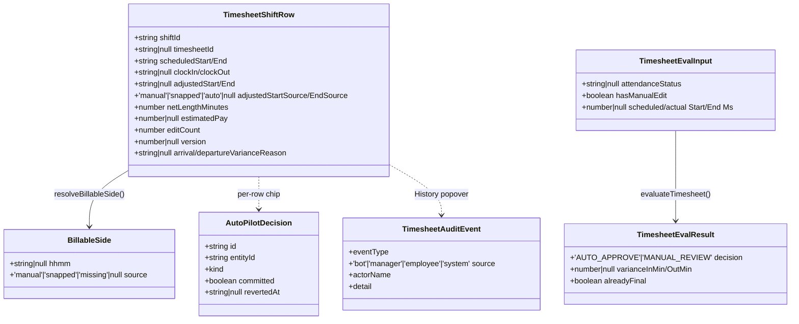

# 1 · Architecture Overview

## 1.1 Where the module lives

```
src/modules/timesheets/
├── index.ts                         # barrel export
├── model/timesheet.types.ts         # TS domain types + status state-machine doc
├── api/
│   ├── timesheets.supabase.api.ts   # ★ LIVE data path (shifts + timesheet overlay)
│   ├── timesheets.read.api.ts       # legacy in-memory mock store (vestigial)
│   ├── timesheets.write.api.ts      # legacy in-memory state machine (vestigial)
│   ├── timesheetAutoPilot.api.ts    # AutoPilot adapter (policy + decisions + revert)
│   ├── timesheetAudit.api.ts        # provenance-timeline reader
│   └── __tests__/…                  # approval-gate + concurrency tests
├── domain/
│   ├── billable-time.ts             # ★ canonical 3-tier billable resolver (shared w/ payroll)
│   ├── billable-edit.ts             # pure edit validation + variance detection
│   ├── variance-reasons.ts          # arrival/departure reason lists + ±5m grace
│   └── __tests__/…
├── state/
│   ├── timesheet.hooks.ts           # legacy hooks over the mock store (vestigial)
│   └── TimesheetContext.tsx         # legacy provider (vestigial)
└── ui/
    ├── TimesheetPage.tsx            # ★ page: scope, date, fetch, actions
    └── components/                  # Table, Row, Timecard, Mobile, History, badges, export, filters
```

Supporting code **outside** the module:

| Concern | Location |
|---------|----------|
| Generic AutoPilot framework | [src/modules/core/autopilot/](../../src/modules/core/autopilot/) (`types.ts`, `useAutoPilot.ts`, `AutoPilotControl.tsx`, `AutoPilotDecisionChip.tsx`) |
| Live-Rules engine + review gate | [src/modules/rosters/domain/shift-ui.ts](../../src/modules/rosters/domain/shift-ui.ts) (`getLiveRuleBadges`, `getPayrollRuleBadges`, `isTimesheetReviewable`) |
| Attendance scorecard | [src/modules/rosters/domain/attendance-metrics.ts](../../src/modules/rosters/domain/attendance-metrics.ts) + `AttendanceMetricsBar` |
| Cost estimate (award, not payroll) | [src/modules/rosters/domain/projections/utils/cost/](../../src/modules/rosters/domain/projections/utils/cost/) |
| Payroll consumer of approved timesheets | [src/modules/payroll/data/grossPay.read.api.ts](../../src/modules/payroll/data/grossPay.read.api.ts) |
| Auth / permissions | [src/platform/auth/access.policy.ts](../../src/platform/auth/access.policy.ts), [useAuth.ts](../../src/platform/auth/useAuth.ts) |
| DB schema / triggers / RPCs | `supabase/migrations/*timesheet*.sql` + baseline `20251015000000_baseline_schema.sql` |
| Auto-verify worker | [supabase/functions/auto-verify-timesheets/](../../supabase/functions/auto-verify-timesheets/) |

## 1.2 Layered dependency graph

```mermaid
flowchart TD
    subgraph UI
      TP[TimesheetPage.tsx]
      TT[TimesheetTable.tsx]
      TR[TimesheetRow.tsx]
      TMV[TimesheetMobileView / MobileCard]
      THP[TimesheetHistoryPopover.tsx]
      APC[AutoPilotControl.tsx]
      AMB[AttendanceMetricsBar]
    end
    subgraph State/Adapters
      SUPA[timesheets.supabase.api.ts]
      TAP[timesheetAutoPilot.api.ts]
      TAU[timesheetAudit.api.ts]
      UAP[useAutoPilot.ts]
    end
    subgraph Domain
      BT[billable-time.ts]
      BE[billable-edit.ts]
      VR[variance-reasons.ts]
      SUI[shift-ui.ts · Live Rules + gate]
      COST[cost estimator]
      AM[attendance-metrics.ts]
    end
    subgraph Database (Supabase / Postgres)
      SH[(shifts)]
      TS[(timesheets)]
      TAR[(timesheet_approval_rules)]
      TD[(timesheet_decisions)]
      TAL[(timesheet_audit_log)]
      TRQ[(timesheet_review_queue)]
      RPC{{RPCs + triggers}}
    end
    subgraph Worker
      WK[auto-verify-timesheets edge fn]
      VARW[variance.ts]
    end

    TP --> SUPA & TAP & AMB & APC
    TP --> TT --> TR
    TT --> TMV
    TR --> THP & SUI & BE & VR & COST
    TR --> TAP
    THP --> TAU
    APC --> UAP --> TAP
    SUPA --> BT & SH & TS
    SUPA --> SUI
    TAP --> TAR & TD & RPC
    TAU --> TAL
    AMB --> AM
    BE --> VR
    WK --> VARW & RPC
    RPC --> TS & SH & TD & TAL & TRQ
    SH -. enqueue trigger .-> TRQ
    TS -. provenance/edit/version/notify triggers .-> TAL & TD
```

## 1.3 Frontend architecture

- **React + Zustand-free page state.** `TimesheetPage` holds local `useState` for
  scope, date/range, view mode (`table`/`timecard`), search, status filter,
  loaded `shifts`, and the AutoPilot decisions map. It fetches directly via
  `getShiftsForTimesheet` (it does **not** use `TimesheetContext`/`useTimesheets`).
- **Scope-aware.** `useScopeFilter(scopeMode)` drives org/dept/subdept selection;
  managers get `'managerial'` mode, everyone else `'personal'`. See
  [TimesheetPage.tsx#L57-L64](../../src/modules/timesheets/ui/TimesheetPage.tsx#L57).
- **Data transform.** Raw `TimesheetShiftRow[]` → UI `TimesheetRow[]` in a memo,
  applying the status-tab filter and formatting clocks to Sydney wall-clock.
- **Two render surfaces** that must never diverge: desktop `TimesheetTable`
  (table + timecard views) and `TimesheetMobileView`; both derive attendance
  state from the same `timesheetEntryToShiftInput` projection.

## 1.4 Backend architecture

There is **no bespoke Node/REST backend**. The "backend" is Supabase:

- **PostgREST** for CRUD on `shifts` / `timesheets` / autopilot tables (via
  `supabase-js`), gated by **Row-Level Security**.
- **Postgres functions (RPCs)** for the autopilot commit gateway, queue
  claim/complete, revert, window check, and the reviewable gate.
- **Postgres triggers** for provenance audit, edit-count, version bump, review
  gate, outcome notifications, and auto-verify enqueue.
- **Deno Edge Function** (`auto-verify-timesheets`) as the async worker, invoked
  by `pg_cron` (planned; not deployed).

## 1.5 Data-flow: manager review (happy path)

1. Page loads shifts + timesheet overlay for the scope/date (`getShiftsForTimesheet`).
2. Each row resolves billable start/end (`resolveBillableSide`) and net minutes.
3. Manager edits adjusted times → `validateBillableEdit` → (optional variance
   reason modal) → `updateTimesheetEntry` upserts the `timesheets` row.
4. Manager approves → completeness guard runs → `timesheets.status='approved'`,
   `shifts.lifecycle_status='Completed'`.
5. DB triggers fire: provenance audit row, version bump, edit-count, outcome
   notification to the employee.
6. Payroll's `grossPay.read.api.ts` later prices the shift from the SAME billable
   resolver, `approvedOnly` by default.

## 1.6 Class / type diagram (core types)



## 1.7 Notable architectural finding — two API lineages

The module ships **two parallel APIs**:

| Lineage | Files | Backing store | Status |
|---------|-------|---------------|--------|
| **Live (used)** | `timesheets.supabase.api.ts` | Supabase `shifts` + `timesheets` | Active — the page calls this directly. |
| **Legacy (vestigial)** | `timesheets.read.api.ts`, `timesheets.write.api.ts`, `timesheet.hooks.ts`, `TimesheetContext.tsx` | In-memory array seeded **empty** | Not wired to the page. `useTimesheets` would return `[]`. Retains the `DRAFT→SUBMITTED→APPROVED→LOCKED` transition table and the `LOCKED` terminal state, which the live path does **not** implement. |

The `LOCKED` status and the strict client-side transition validator therefore
exist only in the vestigial lineage. The live status set is
`draft/submitted/approved/rejected/no_show`. See
[05-business-rules-and-validations.md](05-business-rules-and-validations.md#status-model).
