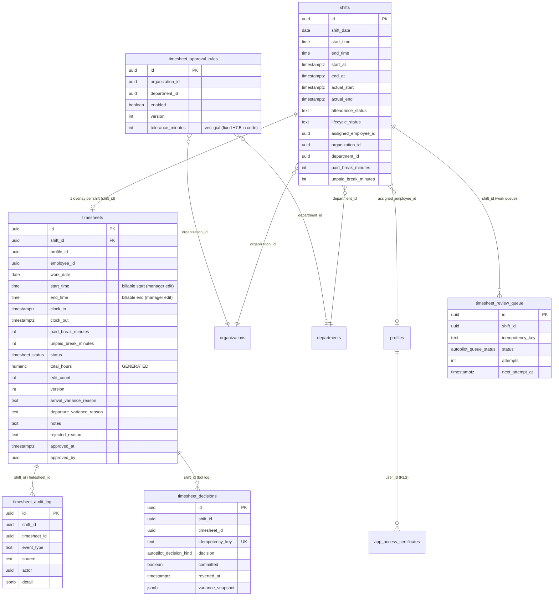

# 4 · Database Documentation

All objects live in the `public` schema of the Supabase Postgres database.
Migration provenance is noted per object. Per project memory, the **AutoPilot
migrations (`2026072*`) are NOT yet applied to prod**; the baseline `timesheets`
table and review gate ARE.

## 4.1 ER diagram

## 4.2 `timesheets` — the core overlay table

Defined in [baseline_schema.sql#L20968](../../supabase/migrations/20251015000000_baseline_schema.sql#L20968);
extended by later migrations. One row per shift (via `shift_id`), created lazily.

| Column | Type | Null | Notes |
|--------|------|------|-------|
| `id` | uuid | no | PK, `gen_random_uuid()`. |
| `profile_id` | uuid | no | Employee (legacy FK-less link). Set = `assigned_employee_id` on insert. |
| `employee_id` | uuid | yes | Also set = `assigned_employee_id`. Notification recipient = `COALESCE(employee_id, profile_id)`. |
| `assignment_id` | uuid | yes | Legacy. |
| `shift_id` | uuid | yes | **The real join key** to `shifts`. |
| `work_date` | date | no | = `shifts.shift_date`. |
| `start_time` | time | yes | **Billable start** — set only on an explicit manager edit; null otherwise. |
| `end_time` | time | yes | **Billable end** — same rule. |
| `clock_in` | timestamptz | no | `now()` default; seeded from `actual_start`/`start_at` on insert. |
| `clock_out` | timestamptz | yes | Seeded from `actual_end`/`end_at`. |
| `break_minutes` | int | yes | Legacy break field (default 0, `>=0` check). |
| `paid_break_minutes` | int | yes | Manager-editable paid break. |
| `unpaid_break_minutes` | int | yes | Manager-editable unpaid break (subtracted from net). |
| `total_hours` | numeric(5,2) | — | **GENERATED STORED**: `round((epoch(end_time-start_time)/3600) - break_minutes/60, 2)`. |
| `net_hours` | numeric(5,2) | yes | Default 0.00 (legacy; UI computes net client-side). |
| `status` | `timesheet_status` enum | yes | Default `'draft'`. See §4.3. |
| `notes` | text | yes | Approval override reason / bulk note / auto-verify note. |
| `rejected_reason` | text | yes | Manager rejection reason (shown to employee). |
| `submitted_at` / `approved_at` | timestamptz | yes | Lifecycle stamps (`approved_at` set on approve). |
| `approved_by` | uuid | yes | Cleared on auto-verify revert. |
| `edit_count` | int | no | Default 0. Manager billable/break edit tally (F7). Migration `20260724000000`. |
| `version` | int | no | Default 1. Optimistic-lock row version (F18). Migration `20260724002000`. |
| `arrival_variance_reason` | text | yes | Reason billable **start** varies from roster. Migration `20260724004000`. |
| `departure_variance_reason` | text | yes | Reason billable **end** varies from roster. Same migration. |
| `created_at` / `updated_at` | timestamptz | — | `now()` defaults. |

**RLS:** `FORCE ROW LEVEL SECURITY` is set. Policies are inherited from the
baseline security model (see [07-security-permissions-errors.md](07-security-permissions-errors.md)).

### Triggers on `timesheets`

| Trigger | When | Function | Purpose | Migration |
|---------|------|----------|---------|-----------|
| `trg_enforce_timesheet_review_gate` | BEFORE INSERT/UPDATE | `enforce_timesheet_review_gate()` | Rejects an approve/reject/billable-edit unless the shift is reviewable (terminal attendance). | baseline `#L5741` |
| `trg_timesheet_provenance` | AFTER INSERT/UPDATE | `fn_timesheet_provenance()` | Appends the lifecycle event (CREATED/SUBMITTED/AUTO_APPROVED/MANUALLY_APPROVED/REJECTED/EDITED/REOPENED/REVERTED/NO_SHOW) to `timesheet_audit_log`. `SECURITY DEFINER`, swallows errors. | `20260722100000`, refined `20260723130000` |
| `trg_timesheet_edit_count` | BEFORE UPDATE | `fn_timesheet_edit_count()` | +1 to `edit_count` on human billable/break change (bot excluded via GUC). | `20260724000000` |
| `trg_timesheet_version_bump` | BEFORE UPDATE | `fn_timesheet_version_bump()` | +1 to `version` on **every** update (CAS support). | `20260724002000` |
| `trg_timesheet_outcome_notification` | AFTER UPDATE | `trg_timesheet_outcome_notification()` | `notify_user()` on approve / reject / manager adjust. | `20260724003100` |

## 4.3 `timesheet_status` enum

DB enum values used by the live path (lowercase): `draft`, `submitted`,
`approved`, `rejected`, `no_show`.

- `no_show` is used both as a `timesheets.status` and independently as
  `shifts.attendance_status`.
- **`locked`** appears in the **TS model** (`timesheet.types.ts`) and payroll's
  `APPROVED_STATUSES` set, but the payroll adapter notes *"DB enum has no
  'locked'"* ([grossPay.read.api.ts#L85](../../src/modules/payroll/data/grossPay.read.api.ts#L85)).
  Treat `locked` as a forward-compat TS-only value. **Not verified** in the DB enum.

## 4.4 `timesheet_approval_rules` — AutoPilot policy (per org/dept)

Migration [20260722100000#L39](../../supabase/migrations/20260722100000_timesheet_auto_verify.sql#L39). One
default row per org (`department_id IS NULL`), optional per-dept overrides.

| Column | Type | Notes |
|--------|------|-------|
| `organization_id` | uuid | Scope. Unique per-org where `department_id IS NULL`. |
| `department_id` | uuid | Optional dept override (dept beats org). |
| `enabled` | boolean | **The whole switch.** Default `false`. ON = bot acts. |
| `version` | int | Bumped by `trg_bump_timesheet_policy_version` on any change. |
| `tolerance_minutes` | int | Default 5. **Vestigial** — tolerance is fixed ±7.5 in `variance.ts`. |
| `max_auto_per_employee_per_week` | int | Default 20. **Not currently enforced** by the worker. |
| `require_no_overtime` | boolean | Default true. Vestigial (overtime fails the ±7.5 bound anyway). |
| `schedule_enabled`, `start_time_local`, `end_time_local`, `timezone`, `sweep_daytime_backlog` | — | Added by `20260723120000`, then made **vestigial** by `20260723130000` which fixed the window to 18:00–06:00 Sydney in code. |
| `rules` | jsonb | `{}` default; must be an object. Free-form fallback config. |

**RLS:** ALL (read+write) for org-scoped gamma+ certificate holders or `is_admin()`.

## 4.5 `timesheet_decisions` — bot decision log

Migration [20260722100000#L62](../../supabase/migrations/20260722100000_timesheet_auto_verify.sql#L62).
Append-mostly log of every AutoPilot evaluation (whether committed or routed to
manual review). Key fields: `idempotency_key` (UNIQUE — dedup), `decision`
(`AUTO_APPROVE`/`MANUAL_REVIEW`/`AUTO_REJECT`), `committed` (true once the approve
write lands), `reverted_at`/`reverted_by` (manager undo), `variance_snapshot`
(in/out minutes + tolerance), `policy_version`, `engine_version`, `subtitle`.
**RLS:** SELECT for gamma+; INSERT/UPDATE for `service_role` only.

## 4.6 `timesheet_audit_log` — append-only provenance timeline

Migration [20260722100000#L85](../../supabase/migrations/20260722100000_timesheet_auto_verify.sql#L85).
The single source of "who did what, when" per shift's timesheet. **Append-only**:
`trg_timesheet_audit_append_only` raises on any UPDATE/DELETE. Populated only by
the provenance trigger + the decide RPC's `BOT_REVIEW` insert. `event_type` is
free text; `source ∈ {bot, manager, employee, system}`. Read via
[getTimesheetAuditTrail](../../src/modules/timesheets/api/timesheetAudit.api.ts#L68).
**RLS:** SELECT for gamma+.

## 4.7 `timesheet_review_queue` — async work queue

Migration [20260722100000#L100](../../supabase/migrations/20260722100000_timesheet_auto_verify.sql#L100).
Durable queue of shifts to auto-verify. `status ∈ {PENDING, CLAIMED, DONE, DLQ}`,
`attempts`/`max_attempts` (5), `next_attempt_at` (exp-backoff), unique
`(shift_id, idempotency_key)`. Claimed via `SELECT … FOR UPDATE SKIP LOCKED`.
**RLS:** `service_role` only.

## 4.8 Functions / RPCs (full list)

| Function | Lang / security | Purpose |
|----------|-----------------|---------|
| `is_shift_timesheet_reviewable(uuid) → bool` | SQL STABLE, DEFINER | Terminal-attendance gate. True if `attendance_status ∈ {no_show, auto_clock_out}` OR `actual_end IS NOT NULL` OR (no `actual_start` AND `now() > COALESCE(end_at, start_at + 12.5h)`). Mirrors client `isTimesheetReviewable`. baseline `#L9515`. |
| `enforce_timesheet_review_gate() → trigger` | plpgsql DEFINER | Blocks decisions/billable-edits on a non-reviewable shift. baseline `#L5741`. |
| `is_timesheet_autopilot_active(org, dept, ts) → bool` | plpgsql STABLE DEFINER | `enabled` AND now() ∈ fixed 18:00–06:00 Sydney (DST-safe). `20260723130000#L30`. |
| `enqueue_timesheet_auto_verify() → trigger` | plpgsql DEFINER | On `shifts` UPDATE crossing into reviewable, enqueues if policy enabled. `20260723130000#L67`. |
| `sm_timesheet_queue_claim(worker, limit) → SETOF queue` | plpgsql DEFINER | Claims due rows, `SKIP LOCKED`, reclaims stale (5 min) CLAIMED. |
| `sm_timesheet_queue_complete(id, status, err) → jsonb` | plpgsql DEFINER | Settle DONE, or backoff/DLQ on retry. |
| `sm_timesheet_auto_decide(shift, idem_key, payload) → jsonb` | plpgsql DEFINER | **Commit gateway.** Idempotency, window/revert/reviewable/enabled re-guards, writes the decision row, and on `AUTO_APPROVE` flips `timesheets.status='approved'` + `shifts.lifecycle_status='Completed'`. Returns a code (`COMMITTED`/`MANUAL_REVIEW`/`OUTSIDE_WINDOW`/…). `20260723130000#L204`. |
| `sm_timesheet_auto_revert(decision_id, actor) → jsonb` | plpgsql DEFINER | Undo a committed auto-verify: `approved → submitted`, clears `approved_*`, stamps `reverted_at`. Sets `app.timesheet.revert` GUC so the audit logs `REVERTED`. |
| `sm_timesheet_enqueue_backlog(org, days) → jsonb` | plpgsql DEFINER | Daytime backlog sweep (superseded — worker sweeps naturally). `20260723120000#L129`. |
| `fn_bump_timesheet_policy_version()` | plpgsql | Bumps `timesheet_approval_rules.version` on change. |

All bot RPCs are `REVOKE`d from `anon`/`PUBLIC` and `EXECUTE`-granted to
`service_role` (and, for `sm_timesheet_auto_revert`, `authenticated`).

## 4.9 Session GUCs (context flags)

The decide/revert RPCs set transaction-local GUCs so the shared triggers can tell
**who** is writing:

| GUC | Set by | Read by | Effect |
|-----|--------|---------|--------|
| `app.timesheet.autopilot` | `sm_timesheet_auto_decide` (the decision id) | provenance, edit-count, notification triggers | Marks the write as bot → logs `AUTO_APPROVED` (not `MANUALLY_APPROVED`/`EDITED`), excludes it from `edit_count`, and messages the employee as "auto-approved". |
| `app.timesheet.revert` | `sm_timesheet_auto_revert` (`'1'`) | provenance trigger | Logs `REVERTED` instead of `REOPENED`. |

## 4.10 `shifts` columns the module depends on

The module reads (never mutates the clock columns): `shift_date`, `start_time`,
`end_time`, `start_at`, `end_at`, `actual_start`, `actual_end`,
`attendance_status`, `attendance_note`, `lifecycle_status`, `assignment_status`,
`assigned_employee_id`, `organization_id`/`department_id`/`sub_department_id`,
`role_id`, `remuneration_level`, `paid_break_minutes`, `unpaid_break_minutes`,
`scheduled_length_minutes`, `net_length_minutes`, `remuneration_rate`, and the
`roster_subgroups`/`roster_groups` join. It **writes** `attendance_status`,
`lifecycle_status`, `attendance_note`, `last_modified_by` (on no-show / approve
completion / no-show override). See
[getShiftsForTimesheet](../../src/modules/timesheets/api/timesheets.supabase.api.ts#L131)
and [markShiftAsNoShow](../../src/modules/timesheets/api/timesheets.supabase.api.ts#L761).
