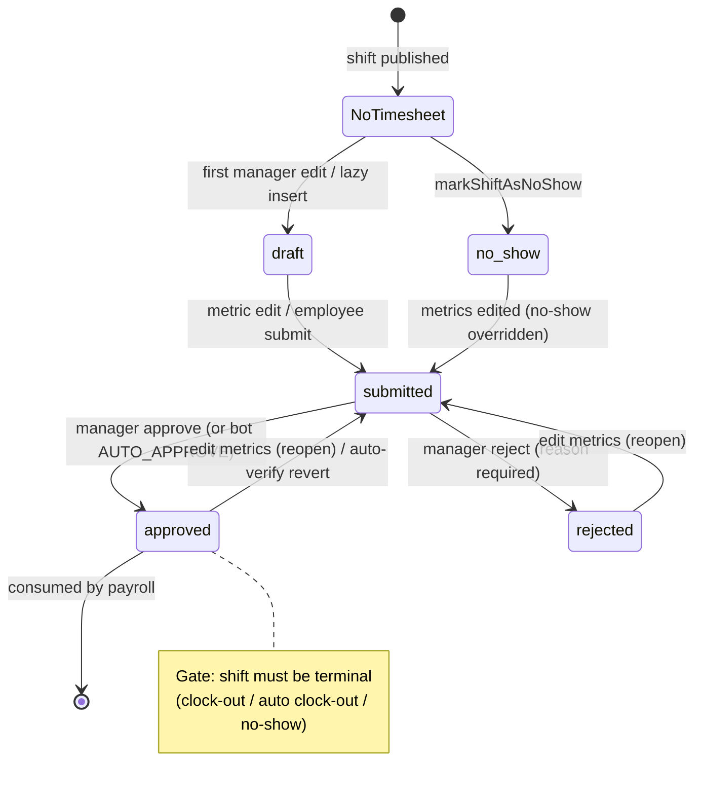
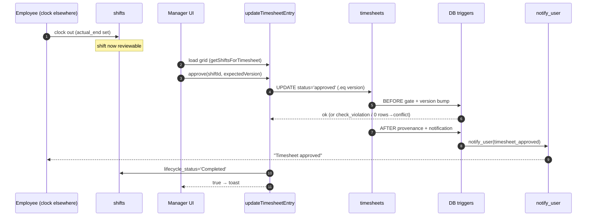
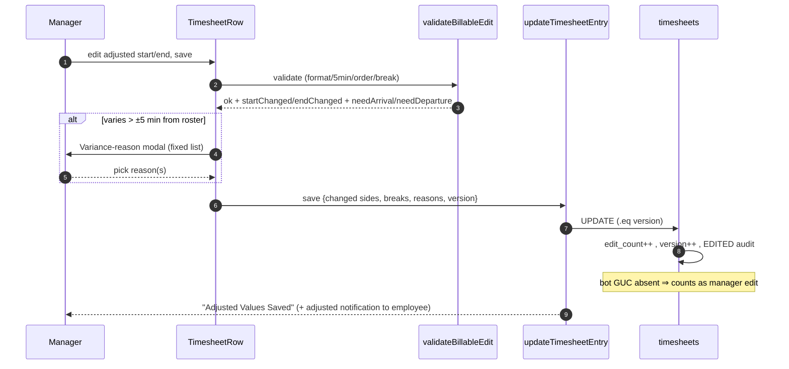
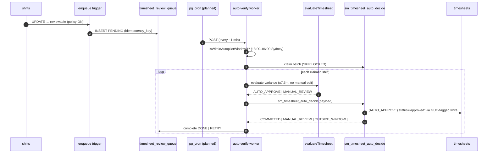
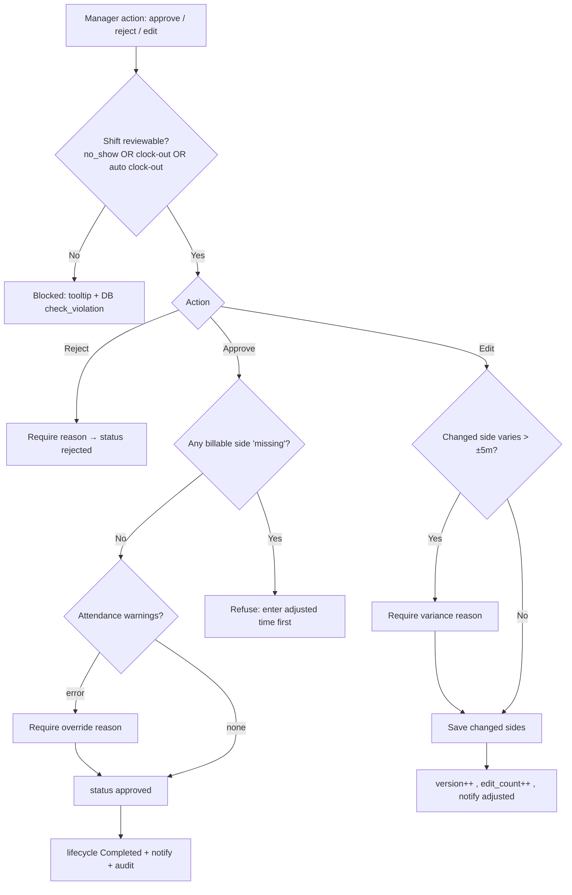
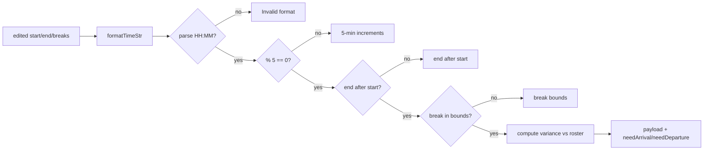
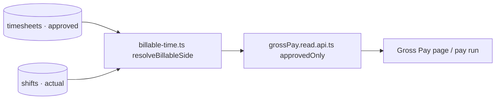

# 6 · Workflows, Sequence Diagrams & Flowcharts

## 6.1 Overall lifecycle (state machine)

## 6.2 Manager approval workflow (step by step)

1. **Entry point:** manager opens `/timesheet`, selects scope + date.
2. `getShiftsForTimesheet` loads shifts + timesheet overlay; billable resolved.
3. Manager clicks **Approve** on a row.
4. **Guard:** status must be `submitted`/`draft`, not `no_show`; if
   `reviewLocked`, blocked with a tooltip.
5. If any warnings → **Approve-warnings modal**; `error` warnings require an
   override reason.
6. `handleSaveEntry` → `updateTimesheetEntry(id, {status:'approved', notes?}, {expectedVersion})`.
7. **DB path:** review-gate trigger validates terminal state; completeness guard
   ensures no `missing` side; version bump; `status='approved'`,
   `approved_at=now()`.
8. `shifts.lifecycle_status='Completed'`.
9. **Triggers:** provenance → `MANUALLY_APPROVED`; outcome-notification →
   `notify_user(timesheet_approved)`.
10. **Exit:** payroll can now price the shift (`approvedOnly`).

## 6.3 Sequence — employee submission → manager approval

## 6.4 Sequence — billable edit with variance reason

## 6.5 Sequence — AutoPilot auto-verify (async)

## 6.6 Flowchart — the review gate + completeness guard

## 6.7 Flowchart — validation pipeline (client)

## 6.8 Data-flow — timesheet → payroll

