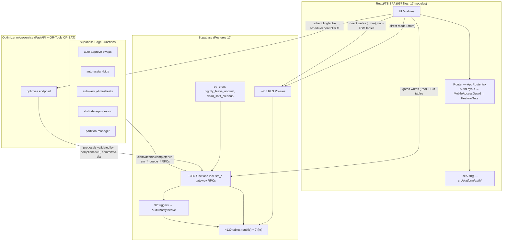
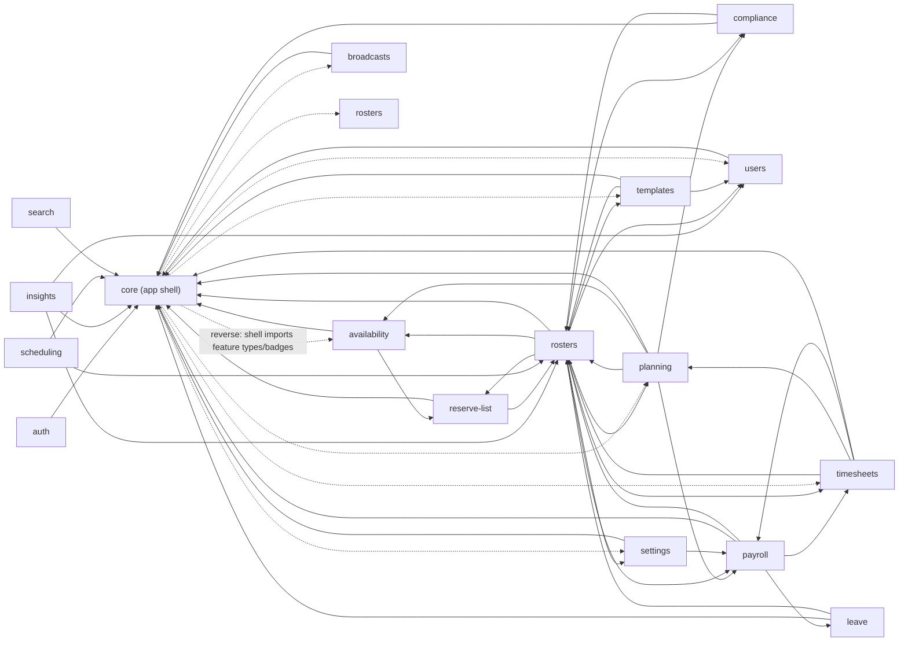
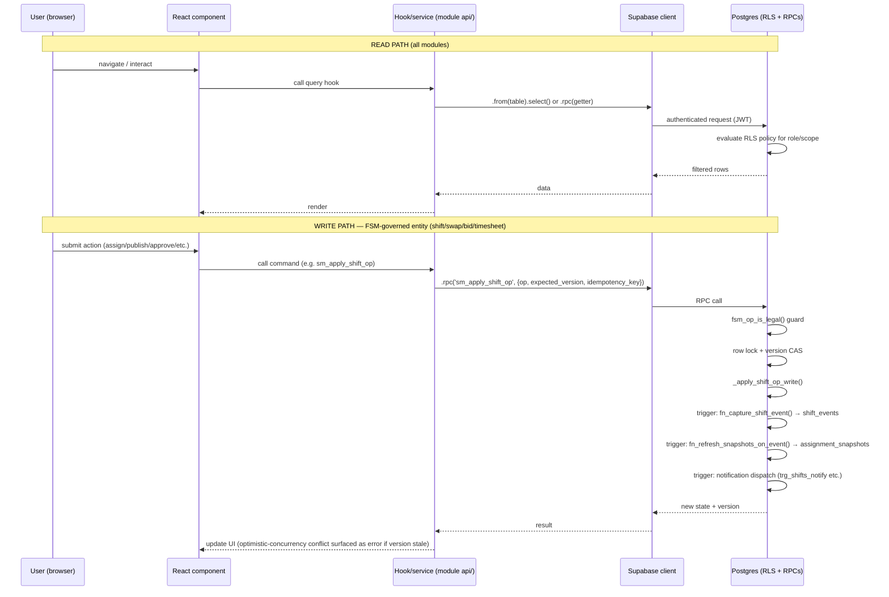
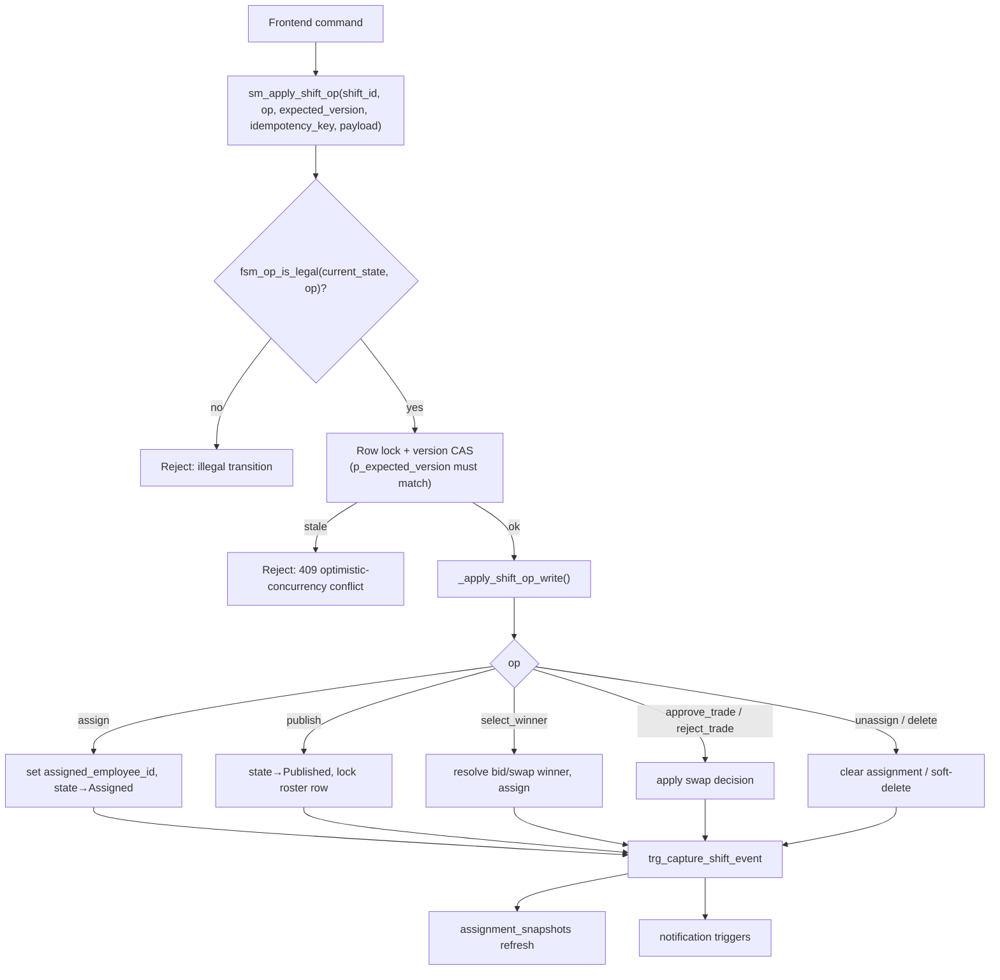
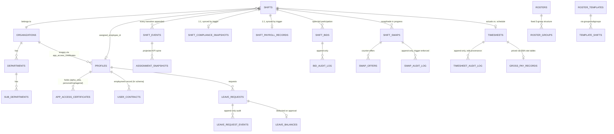
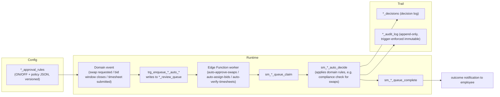
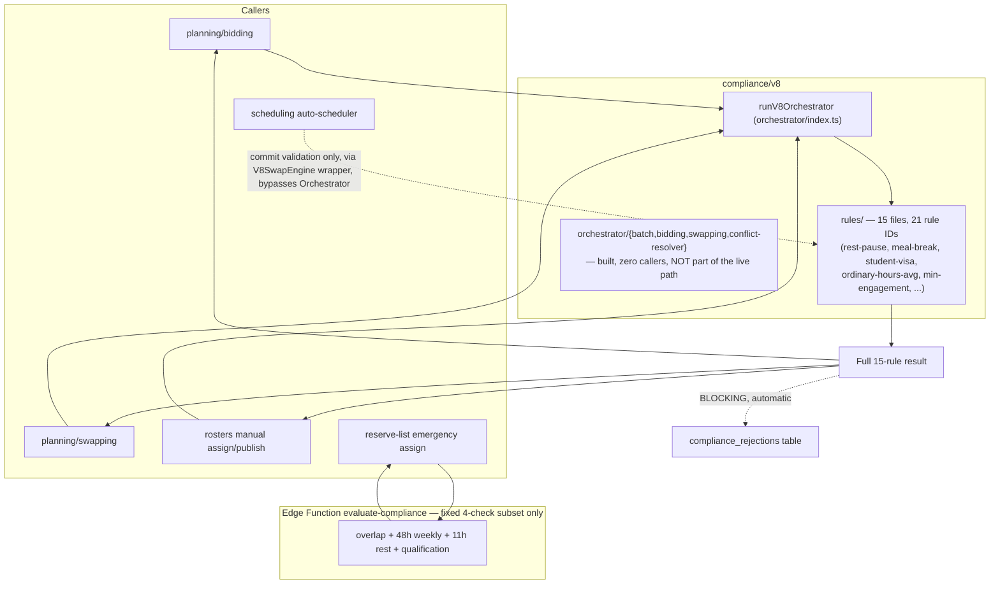
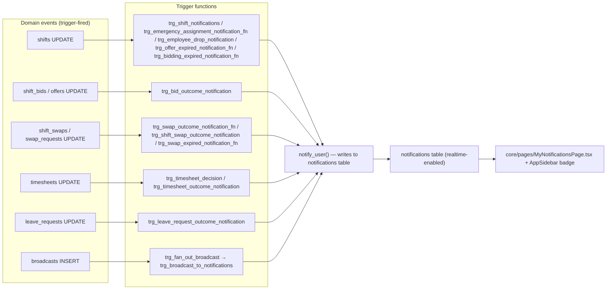
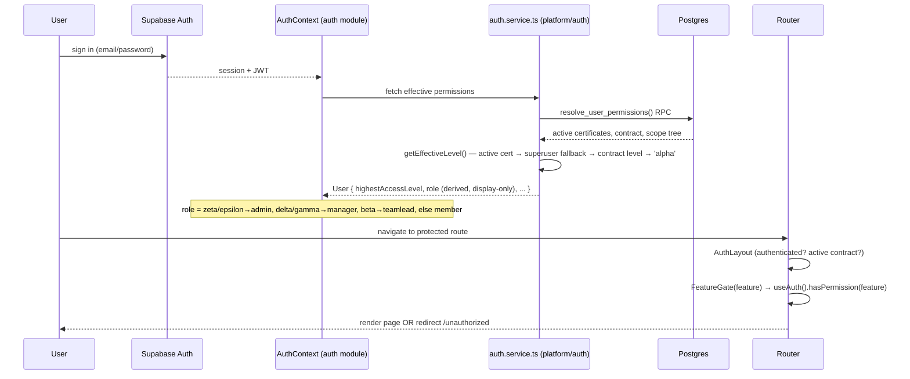

# Chapter 2 — Architecture (Phase 2)

**Confidence:** diagram *topology* (which components exist and talk to which) is **Verified** — each edge traces to a specific import, RPC call, or trigger found in Ch. 1. Internal *sequencing* within a box (exact step order inside e.g. the compliance engine or the optimizer pipeline) is **Strongly Inferred** pending the deeper Ch. 3/7/12 passes — treat step ordering as indicative, not a verified contract, until those chapters land.

## 1. Overall architecture



**Key architectural rule (Verified):** anything governed by a state machine (shifts, swaps, bids, timesheets) is **never** written directly via `.from(table).update()` from the client — always through an `sm_*` RPC gateway with optimistic concurrency (`p_expected_version`) and, for the marketplace, an idempotency key. Non-FSM tables (availability, broadcasts, settings, leave requests pre-approval) are written directly, protected by RLS alone.

## 2. Module relationships



**Reading this:** `rosters` is the structural hub — 10 of the other 16 modules depend on it (shift/roster entities, eligibility, compliance-service, bulk-assignment engine). `core` has an unusual *bidirectional* relationship: every module depends on it for shell/primitives, but it also reaches back into 7 feature modules for global nav badges and its central type-re-export barrel. `search`, `users`, and `auth` are the shallowest ("leaf") modules — few or no dependents reach further into the graph through them.

## 3. Data flow (read vs. write path)



## 4. API/RPC gateway pattern



This single gateway (`sm_apply_shift_op`) is the closest thing this platform has to a formal "shift API" — every legal shift-state transition, regardless of which frontend module initiated it (Rosters, Planning/Bidding, Planning/Swapping, Reserve List, Scheduling's auto-committer), funnels through it. This is why Ch. 1 found so few direct `.rpc()` call sites per module for shift mutation — they nearly all resolve to this one function with a different `op` argument.

## 5. Database relationships (core spine, not full ERD)



## 6. Scheduling engine (auto-scheduler) — first pass

```mermaid
sequenceDiagram
    participant Mgr as Manager
    participant Ctrl as AutoSchedulerController (.run)
    participant Opt as Optimizer microservice (OR-Tools CP-SAT)
    participant Comp as compliance/v8 orchestrator
    participant Commit as AutoSchedulerController (.commit)
    participant DB as Postgres

    Mgr->>Ctrl: request auto-fill (unassigned shifts in view)
    Ctrl->>DB: fetch shifts, availability, leave_requests
    Ctrl->>Opt: OptimizeRequest (shifts, employees, constraints, strategy)
    alt optimizer succeeds
        Opt-->>Ctrl: AssignmentProposal[]
    else optimizer fails/unavailable
        Ctrl->>Ctrl: fall back to rosters/bulk-assignment greedy engine
    end
    Ctrl->>Comp: validate each proposal (V8 orchestrator)
    Comp-->>Ctrl: ValidatedProposal[] (pass/fail per shift, with rationale)
    Ctrl-->>Mgr: preview (PillarScores, ParetoAlternative, WhyThisPerson)
    Mgr->>Commit: approve/commit selected proposals
    Commit->>DB: concurrency re-check (shift not since modified/taken)
    Commit->>DB: rosters/bulk-assignment engine → sm_apply_shift_op(assign) per shift
    DB-->>Commit: results (some may now conflict if raced)
    Commit-->>Mgr: commit summary (assigned / skipped-due-to-race)
```

**Confidence: Strongly Inferred.** `auto-scheduler.controller.ts` is 1,479 lines; this diagram reflects the module inventory and DB-inventory findings (optimizer client, fallback to bulk-assignment, compliance validation, concurrency recheck at commit) but has not yet had a line-by-line read — a dedicated Ch. 3/7 pass on `scheduling` should confirm exact sequencing and error paths.

## 7. The AutoPilot pattern (Swaps, Bids, Timesheets)

Three independent features share one architecture, confirmed structurally identical across all three domains in Ch. 1 §4:



Each subsystem is independently toggleable (per org/department, via its `*_approval_rules` row) — "AutoPilot" is a config flag, not a separate code path; when off, the same domain event instead routes to a manager for manual decision. See project memory `autopilot-uniform-feature` for the frontend control surface (not yet deployed to workers as of last check — verify current deployment status before relying on this).

## 8. Marketplace lifecycle (Bids & Swaps)

**Superseded by Ch. 7 §3 — corrected here, not just there, since the original version of this diagram described the wrong system.** This section originally generalized from `planning`'s `PlanningRequestStatus` type (`OPEN→MANAGER_PENDING→APPROVED/REJECTED/BLOCKED/CANCELLED/EXPIRED`), assuming the newer unified `planning_requests`/`planning_offers` model was live. Ch. 7's deep pass proved that model, while real and functional, **is never called from any routed UI** — every marketplace route and API call site hits the legacy `shift_bids`/`shift_swaps`/`swap_offers` tables directly. See Ch. 7 §3.1 for the evidence and §3.4 for the verified transition diagram and table (which also documents a manager-swap-approval bug found and fixed while tracing this lifecycle).

**Confidence: Verified** (superseding the prior Strongly-Inferred tag on this diagram).

## 9. Compliance engine — structural view



**Corrected from an earlier pass of this diagram — see Ch. 12 for full detail.** Reserve List and the two AutoPilot Edge Function workers (`auto-approve-swaps`, `auto-assign-bids`) do **not** run the full 15-rule engine — they call a separately-deployed Edge Function with a fixed 4-check subset (overlap, 48h weekly cap, 11h rest, qualification), a documented v1 gap per those workers' own READMEs. The autoscheduler's commit-time validation *does* run the full rule set, but via a different wrapper (`V8SwapEngine`) that bypasses `runV8Orchestrator` — so its BLOCKING results are never written to `compliance_rejections`, unlike manual assign and bid/swap accept. `adapters/` is organized by protocol version (v1/v2), not by caller — the real per-caller input builders live in `planning/unified/compliance/input-builder.ts`. The `orchestrator/{batch,bidding,swapping,conflict-resolver}` subfolders implement a sophisticated global-optimization layer with zero production callers today.

**Structural rule confirmed (Verified, via Ch. 1 §2.4/2.9/2.11/2.12/2.10):** every caller module goes through the same `v8/orchestrator` + `v8/rules` — there is no second, independently-implemented compliance path. This is the platform's single most important architectural invariant; Ch. 12 (Compliance Engine deep dive) will document each rule in `rules/` individually.

## 10. Notification flow



All notification delivery is **database-trigger-driven, not application-code-driven** — the frontend never calls a "send notification" function directly; it only ever reacts to writes on domain tables, and Postgres triggers decide what (if anything) gets notified. This means notification rules (Ch. 13) live entirely in SQL, not in `src/`.

## 11. Authentication flow



Full role/permission model, the two dead-code parallel systems, and the per-feature-area permission matrix are Ch. 8.

## 12. What's not yet diagrammed accurately

Attendance lifecycle (clock-in/out → auto clock-out → timesheet generation), the shift FSM's full transition table, the timesheet review-gate lifecycle, and the leave↔shift conflict-resolution flow are now traced end-to-end with source citations in **Ch. 7 (State Machines)** — §1 (shift FSM), §2.5 (clock-in/out mechanics), §4.3 (leave/shift conflicts). Treat Ch. 7 as authoritative over any inference in this chapter where the two differ; this chapter (§6, scheduling engine; §9, compliance engine structure) is still a first pass pending a dedicated Ch. 3/12 module deep-dive.
