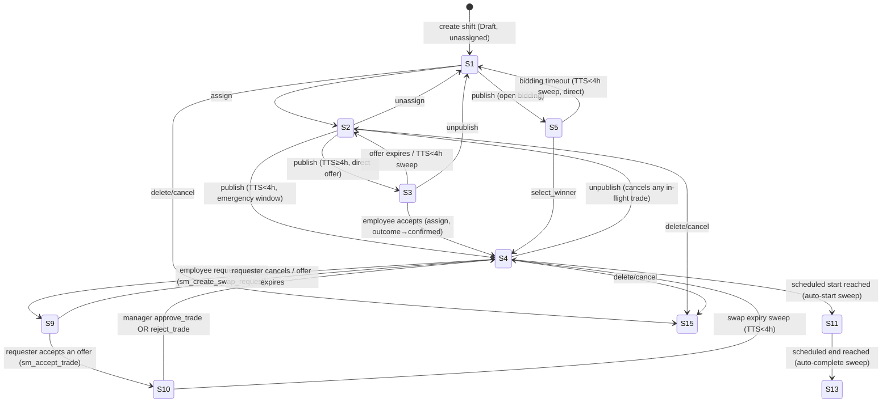
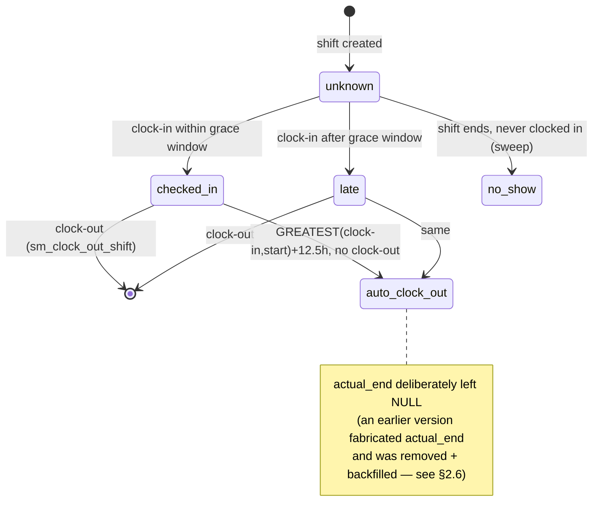
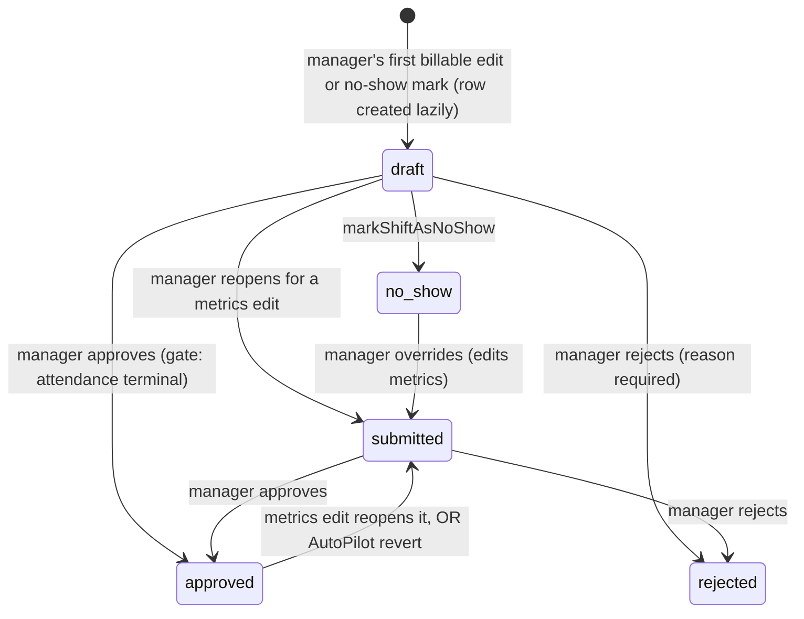

# Chapter 7 — State Machines (Phase 7)

**Confidence:** all four state machines below were traced directly against migration SQL bodies, live prod function definitions (via MCP), and `src/` source — not inferred from names. Per-section confidence notes flag the few places evidence was indirect. This chapter corrects several claims in Ch. 2 (which was written before this deep pass) — Ch. 2 §8's marketplace-lifecycle diagram in particular described the wrong system as live; see §3.1.

## ⚠ Fixed during this chapter's research (2026-07-31)

**Manager "Approve Swap Request" — and Swap AutoPilot's auto-approve — were completely non-functional in production.** `fsm_op_is_legal('S10', 'approve_trade')` correctly allowed the transition, but the function that actually executes gateway writes, `_apply_shift_op_write()`, had no branch for `approve_trade` and fell through to `UNSUPPORTED_OP`. Every call from either the manager's manual Approve button (`swaps.api.ts:776-778`) or `sm_swap_auto_decide`'s `AUTO_APPROVE` path — both send the identical payload `{compliance_ok: true}` — failed. Root cause: a working `approve_trade` branch existed pre-squash (`migrations_archive_pre_baseline_20260702/20260630001100_audit_single_record_create_update.sql:505-538`) and was silently dropped when the schema was baselined in October 2025; nothing since then re-added it. **Fixed and applied to prod** via `supabase/migrations/20260731000000_restore_approve_trade_branch_in_apply_shift_op_write.sql` — restored the branch (compliance-gate check → locate the `MANAGER_PENDING` swap → delegate the actual two-way reassignment to the still-live `sm_approve_peer_swap()`, previously only reachable from the *undo* path → flip `shift_swaps` to `APPROVED`). Verified with a rollback-only transaction against live prod tables (confirmed the branch is reached and calls through correctly) and `get_advisors` (no new findings). At time of fix, 0 swaps were `MANAGER_PENDING`, so no data was left stuck mid-flight — this was caught before it produced a support incident, not after.

This is the second live production bug found and fixed while building this rulebook (see Ch. 8 §5 for the first, an RLS gap on payroll/compliance tables). Both evaded the codebase's own deliberate hardening sweeps because neither is the *pattern* those sweeps searched for — see the closing note in §5.

---

## 1. Shift lifecycle FSM

The shift is the central entity; every other lifecycle in this chapter (bids, swaps, timesheets) ultimately reads or writes shift state. All shift-state changes governed by this FSM go through one gateway, `sm_apply_shift_op(shift_id, expected_version, op, payload, idempotency_key)`, which does: row lock → idempotency replay check → optimistic-concurrency version CAS → `fsm_op_is_legal(state, op)` guard → `_apply_shift_op_write()` → unconditional `shift_events` audit insert.

### 1.1 Canonical states

Derived at read time by `get_shift_fsm_state()` from six columns (`lifecycle_status`, `assignment_status`, `assignment_outcome`, `trading_status`, `is_cancelled`, `bidding_status`) — **not** a single stored status column.

| ID | Meaning | Reachable today? |
|---|---|---|
| S1 | Draft, unassigned | Yes |
| S2 | Draft, assigned | Yes |
| S3 | Published, offered — awaiting employee accept/decline | Yes |
| S4 | Published, confirmed | Yes |
| S5 | Published, open for bidding (normal) | Yes |
| S6 | Published, open for bidding (urgent) | **Dead** — nothing sets `on_bidding_urgent` any more; urgency is computed at read time from time-to-start instead |
| S7 | Published, emergency-assigned | **Dead** — the emergency-assign path was deliberately redesigned to land on S4 (with `emergency_assigned_at`/`_by` as a side-channel audit marker) instead of a distinct state |
| S8 | Published, bidding closed with no winner | **Dead** — the timeout sweep was collapsed to jump straight S5/S6→S1; nothing writes this value any more (see §1.6 anomaly 2) |
| S9 | Published, trade requested (awaiting peer) | Yes |
| S10 | Published, trade accepted (awaiting manager) | Yes |
| S11 | In progress | Yes |
| S12 | In progress (emergency) | Dead (depends on dead S7) |
| S13 | Completed | Yes |
| S14 | Completed (emergency) | Dead |
| S15 | Cancelled | Yes (highest priority — short-circuits every other column) |

S6/S7/S8 are kept as enum "tombstones" (Postgres can't cheaply drop enum values) and the legality matrix still lists them as legal `assign`/`delete`/`edit` sources — harmless since nothing produces them, but worth knowing they're vestigial if you encounter them in code. This confirms a documented design discipline: **canonical state numbering is never reused or renumbered**, even when a state is retired — a gap in the sequence is intentional history, not a bug.



### 1.2 Transition table

| op | Legal from | Guard | Notes |
|---|---|---|---|
| `publish` | S1, S2 | Blocks if unassigned and time-to-start (TTS) < 4h (`PUBLISH_TOO_LATE`). If assigned and TTS<4h, **skips the S3 offer step and jumps directly to S4** (emergency window) — one of two "direct-to-S4" jumps. If assigned and TTS≥4h, normal S2→S3 (creates a `shift_offers` row). | |
| `unpublish` | S3, S4, S5, S9, S10 | Cancels any in-flight swap and reverts the counter-shift's trade too. **No TTS/4h guard on manual unpublish** — the 4h lock only applies to `publish` and to the automatic sweeps, not to a manager manually unpublishing. | |
| `assign` | S1–S8 | Re-checks `check_shift_overlap()` at commit time (closes a race where a candidate could be double-booked between search and commit — the "Reserve List hardening"). Auto-confirms if the shift is already Published. | |
| `unassign` | S2 only | Draft-only by design — a published assigned shift (S3/S4) must be `unpublish`ed first; there is no defined "unassigned-published" state. | |
| `select_winner` | S5, S6 | Sets the winning bid `accepted`, rejects all other `pending` bids on that shift, jumps directly to **S4** — the second "direct-to-S4" jump (bidding never passes through a separate "won" state). | |
| `approve_trade` | S10 | **Was broken (`UNSUPPORTED_OP`), fixed 2026-07-31 — see the callout above.** Requires `compliance_ok:true` in the payload; delegates the actual reassignment to `sm_approve_peer_swap()`. | |
| `reject_trade` | S9, S10 | Finds the `MANAGER_PENDING` swap, sets it `REJECTED`, reverts trading_status to `NoTrade` on both shifts. Always worked correctly. | |
| `delete` | S1–S10 | Soft-delete (`deleted_at`). Not legal once InProgress/Completed/Cancelled. | |
| `edit` | S1–S10 | Field-level; if `assigned_employee_id` is in the payload, internally re-derives current state and re-checks `assign`/`unassign` legality as a side-channel of the edit. | |

### 1.3 Time-based automatic sweeps

**⚠ Finding (OPEN, architectural risk):** there are **four independent, overlapping automatic-transition mechanisms**, not one — this is itself worth flagging for a consolidation pass:

1. **`process_shift_timers()`** — per-minute `pg_cron` job (name provisioned outside migration history, unlike the other two scheduled jobs). Five steps: offer expiry (S3→S2), bidding timeout (S5/S6→S1 directly, no S8 hop), auto-start (S4/dead-S7→S11/dead-S12, gated on `assignment_outcome`), auto-complete (S11→S13, excluding currently-clocked-in employees), swap expiry (S9/S10→S4, plus cascades to expire child `swap_offers` — a gap the introducing migration explicitly fixed for swaps but not for bids, see §3.7).
2. **`sm_run_state_processor()`** — a separate `pg_cron` job confusingly also named `shift-state-processor` in its schedule entry, explicitly documented as distinct from the edge function of the same name. Duplicates offer-expiry and bidding-timeout (steps 2-3), but its own auto-start pass has **no `assignment_outcome` check** — looser than `process_shift_timers`' equivalent step, meaning it would (incorrectly, per the FSM's own intent) auto-start an S3 "awaiting employee decision" shift into InProgress once its scheduled time passes, which `process_shift_timers` deliberately excludes. Also does auto-no-show marking and the 12.5h auto-clock-out safety net (shared with mechanism 3).
3. **`sm_handle_auto_clock_out()`** — a 5-minute cron, explicitly commented "prod-only, not scheduled in any migration file." The *primary* 12.5h auto-clock-out; mechanism 2's Pass 6 is its documented safety net.
4. **Edge functions `shift-lifecycle-updater` and `shift-state-processor`** — a third, independent TypeScript implementation of the same rules, writing directly to `shifts`/`timesheets` via `.update()` with **no FSM gate, no version CAS**. Has a dead filter clause (`.in('lifecycle_status', ['Published','Confirmed'])` — `'Confirmed'` isn't a valid `shift_lifecycle` value) and anchors its 12.5h auto-close off `start_at` alone rather than `GREATEST(actual_start, start_at)`, so it could close a shift earlier than the DB-side rule intends if these ever run against the same data. Per its own migration header, `shift-state-processor` (the edge function) has **no scheduled caller** — it's currently dead code.

Window is uniformly **T-4h before shift start** across bidding, direct offers, and swaps.

### 1.4 Client-side FSM

**Confirmed: there really are two lineages, and the divergence is intentional and self-documented, not a hidden bug.** `src/modules/rosters/domain/shift-fsm.ts`'s `getShiftFSMState()` mirrors the DB function on 10 of its states, explicitly omitting S6/S7/S8/S12/S14 — a sibling file (`shift-op-legality.ts`) states outright: *"This slim lineage deliberately has NO S7 and NO S8 ... We do NOT invent them here."* Because S6/S7/S8/S12/S14 are dead on the DB side too (§1.1), the client's simplification and the DB's actually-reachable state set now agree, even though they arrived at that agreement independently. `getShiftStateDisplay()` maps the canonical ID to a gapless UI-facing `displayId` (S9→"S6", S10→"S7", S11→"S8", S13→"S9", S15→"S10") — this is the mechanism behind the "canonical ID is the contract, display ID is cosmetic" rule referenced elsewhere in project history.

The client's legality matrix (`OP_LEGALITY` in `shift-op-legality.ts`) is a **hand-pinned copy** of the DB matrix, checked by a test comment "fetched from prod 2026-07-02" — there is no automated parity test that calls the real DB function to catch future drift between the two copies.

### 1.5 Audit / notification side effects

Transitions through the gateway always get an unconditional `shift_events` insert. Transitions made *outside* the gateway (the cron sweeps, `sm_emergency_assign`, edge functions) rely on `fn_capture_shift_event`'s per-branch pattern matching, which **has no branch for the auto-clock-out transition** — the 12.5h auto-clock-out produced by `sm_handle_auto_clock_out()` leaves no `shift_events` row at all. Two fully-implemented notification trigger functions, `trg_shift_assigned()` and `trg_shift_cancelled()`, exist and look load-bearing by name but are confirmed **never attached** to any table — the real assign/cancel notifications are handled by the separate `trg_shifts_notify`.

### 1.6 Other anomalies

1. **S8 was retired, then a July-2026 feature was accidentally built on top of the retired transition.** `trg_enqueue_bid_auto_assign`'s entire firing condition is a shift transitioning *into* `bidding_status='bidding_closed_no_winner'` — a transition that (per the migration that retired S8, over a month earlier) can no longer happen anywhere in the codebase. The Bid AutoPilot enqueue pipeline is therefore unreachable via its intended entry point, independent of and in addition to the `/tick` drain endpoint being separately marked "NOT DEPLOYED" in its own README (see §3.7).
2. **Losing bids are never cleaned up on bidding timeout.** When S5/S6 times out to S1 with no winner, the shift reverts but `shift_bids` rows are left `pending` forever, orphaned against a shift that's back in Draft — asymmetric with swaps, where the *same introducing migration* explicitly fixed the equivalent gap for `swap_offers`.
3. **A legacy RPC graveyard exists alongside the live gateway**: `sm_select_bid_winner` is commented `DEPRECATED... to be DROPPED once all call sites use sm_apply_shift_op directly` yet remains the live call site; several `LEGACY_RPC_DISABLED_V3`-raising stubs exist purely so old callers fail loudly.

---

## 2. Timesheet lifecycle

### 2.1 Three independent status dimensions — easy to conflate, don't

| Dimension | Column | Values | Answers |
|---|---|---|---|
| Review state | `timesheets.status` | `draft`, `submitted`, `approved`, `rejected`, `no_show` | Has a manager decided pay-eligibility? |
| Attendance state | `shifts.attendance_status` | `unknown`, `checked_in`, `no_show`, `late`, `excused`, `auto_clock_out` | Did the employee physically clock in/out, and how? |
| Shift lifecycle state | `shifts.lifecycle_status` | `Draft/Published/InProgress/Completed/Cancelled` | Where is the shift in its own FSM (§1)? |

**⚠ Finding (OPEN, doc/type drift):** the frontend `TimesheetStatus` type (`model/timesheet.types.ts`) lists a `LOCKED` value that has **never existed** as a DB enum value, and omits `no_show`, which is real and actively used. `LOCKED` is explicitly dead — a comment in the live API file confirms the real mechanism is `shifts.payroll_exported`, not a status value. Separately, `src/modules/timesheets/api/timesheets.write.api.ts` implements a full parallel state machine (including the phantom `LOCKED` state) against an **in-memory mock store with no Supabase calls at all** — it is not used by the production write path (`timesheets.supabase.api.ts` is), but reads like the real thing to anyone grepping for "timesheet state machine."

### 2.2 The review gate — the one rule this whole lifecycle hinges on

`is_shift_timesheet_reviewable(shift_id)` — a shift is reviewable once: `attendance_status IN ('no_show','auto_clock_out')`, OR `actual_end IS NOT NULL`, OR (never clocked in AND now > scheduled end, defaulting to +12.5h if no end time). The trigger `enforce_timesheet_review_gate()` blocks any approve/reject status change, or any INSERT/UPDATE that sets billable `start_time`/`end_time`, until this is true — raising a hard Postgres exception, not just a soft client-side disable (though the client also disables the button pre-emptively via the same logic, mirrored in `isTimesheetReviewable()`).





**Note on "submitted":** no dedicated employee-submit UI action was found anywhere in `src/` — managers can approve/reject directly from `draft`, treated identically to `submitted` in the row-action logic. If a rulebook reader expects an "employee submits → manager reviews" two-party workflow, that step is aspirational in the DB enum's design but not implemented in the UI today.

### 2.3 AutoPilot decision flow

Enqueue trigger fires only on the edge transition into a terminal attendance state, and only if an `enabled=true` policy row exists for the org/department. The decision rule (`variance.ts`) is "zero-variance clean punches": both actual start and end within ±7.5 minutes of scheduled → `AUTO_APPROVE`; any no-show/auto-clock-out/manual-edit-already-present/missing-instant/out-of-tolerance → `MANUAL_REVIEW`. **It can never `AUTO_REJECT`** — the enum value exists but nothing produces it; rejection is deliberately kept human-only. The commit RPC (`sm_timesheet_auto_decide`) re-validates the org/dept policy, the review-gate, and a fixed **18:00–06:00 Australia/Sydney** processing window (DST-safe) before committing — outside that window it's a no-op even if called directly.

**⚠ Finding (OPEN, latent mislabeling risk):** a later migration states AutoPilot has been "REMOVED from the module" and reinstalls a bot-unaware audit-trigger version that always logs approvals as `MANUALLY_APPROVED`/`source='manager'`. But the enqueue trigger, decide RPC, revert RPC, review queue, and policy table were never dropped — so if a `timesheet_approval_rules.enabled` row is ever flipped back to `true` and the worker deployed, AutoPilot would resume auto-approving end-to-end, but every resulting audit-log row would now be **mislabeled as a manual manager approval**, since the audit trigger no longer reads the GUC the decide RPC still sets. `docs/timesheets/08-autopilot-auto-verify.md` corroborates the "exists but unused, may be dropped" state but doesn't flag this specific mislabeling risk.

### 2.4 Audit, provenance, and concurrency

Two separate logs: `timesheet_decisions` (bot-only, one row per AutoPilot evaluation, including non-committing ones) and `timesheet_audit_log` (append-only, all writers — every INSERT/status-change/billable-edit, with before/after values and a reason on rejection, wrapped in an exception handler so an audit failure can never block the underlying write). Two separate edit-count badges exist and **can disagree**: `timesheets.edit_count` (a DB column bumped exactly once per billable-field UPDATE) versus a History popover's independently-computed count that merges real audit-log rows with client-synthesized events reconstructed from the current row snapshot — the dedup between the two sources is exact-string-match only, so it under/over-counts depending on which sources return data. Optimistic concurrency (`timesheets.version`) is enforced by an unconditional `BEFORE UPDATE` trigger bump plus a client-side `.eq('version', expectedVersion)` CAS; a stale version matches zero rows (no Postgres error), so the app explicitly checks for that and surfaces "Changed by someone else" before refreshing.

### 2.5 Clock-in/out mechanics

Clock-in (`check_in_shift`) and clock-out (`sm_clock_out_shift`) write **only to `shifts`** — no `timesheets` row is created by either. Timesheet row creation is **lazy**: nothing in the DB materializes it from a completed shift; it's created the first time a manager calls an update (billable edit, approve/reject, or no-show mark) for that `shift_id`. Until then, `getShiftsForTimesheet()` presents a shift-overlay view with all timesheet-derived fields defaulted. Confirmed formula for the auto-clock-out anchor: **GREATEST(clock-in, scheduled start) + 12.5 hours**, implemented in two places kept in lockstep (the 5-min cron and the safety-net sweep), plus a client-side mirror for display. `actual_end` is deliberately left NULL on auto-clock-out — an earlier version fabricated a value here (faking an "on time" departure and defeating the whole rule), was removed, and a backfill migration retroactively corrected historical fabrications.

### 2.6 Anomalies (additional to those inline above)

- **Repo/prod drift, structural, not incidental.** Several objects this feature depends on are explicitly documented as existing only in prod (a 5-minute cron, a notification trigger extension referencing "the existing prod function" as if it weren't in source control) — the timesheet feature's true DB state cannot be fully reconstructed from `supabase/migrations/*.sql` alone.
- A stale code comment claims "prod has the `version` column but no bump trigger" — untrue in the current working tree (the trigger exists), leaving a redundant, harmless app-level increment.

---

## 3. Marketplace (Bids & Swaps) lifecycle

### 3.1 Which model is live — corrects Ch. 2 §8

**The legacy model (`shift_bids`, `shift_swaps`, `swap_offers`) is what's actually live in production. The "unified" model (`planning_requests`/`planning_offers`, `PlanningRequestStatus`) is real, working code against real tables — but it is never called from any routed UI.** Every marketplace route (`AppRouter.tsx`) points at `bidding/`/`swapping/` pages; every API call site in those pages hits the legacy tables and RPCs directly; zero references to `planning-request.service.ts` exist outside the `unified/` folder itself. The one point of real overlap: the live bidding page does import the unified module's compliance input-builder for its own compliance evaluation — so it's not fully dead, just its state-machine/table layer is unused. **This corrects Ch. 2 §8**, which (written before this deep pass) presented the unified model's status vocabulary as the live one.

**Naming trap:** `planning_periods` (a real, live, actively-queried table) is an *unrelated* roster-template publish-state concept (draft/seeded/published/archived) that happens to share the `planning_*` prefix with the unused `planning_requests`/`planning_offers` — don't conflate them.

### 3.2 Status enumerations (live model)

| Table | Status values |
|---|---|
| `shift_bids.status` | `pending`, `accepted`, `rejected`, `withdrawn` |
| `shift_swaps.status` | `OPEN`, `OFFER_SELECTED`, `MANAGER_PENDING`, `APPROVED`, `REJECTED`, `CANCELLED`, `EXPIRED` |
| `swap_offers.status` | `SUBMITTED`, `SELECTED`, `REJECTED`, `WITHDRAWN`, `EXPIRED` |

**⚠ Finding (OPEN, minor drift):** the frontend `ShiftSwap` type omits `OFFER_SELECTED` from its 6-value union despite the DB enum having 7. Investigation confirms nothing *writes* that value any more (vestigial from a pre-collapse 3-step offer flow that `sm_accept_trade` now handles in one jump) — harmless today, but a real type/DB mismatch.

### 3.3 Shift-level vs. per-participant state

There is no separate "shift-level bid FSM" — a shift's `bidding_status`/`trading_status` columns are two of the six inputs to the single canonical FSM in §1, while `shift_bids`/`shift_swaps`/`swap_offers` rows are per-participant records kept in lockstep by the RPCs (not by triggers) within the same transaction as the shift-column update — e.g. `select_winner` flips the winning bid, rejects the rest, *and* updates the shift's columns in one statement.

### 3.4 Transition table

```mermaid
stateDiagram-v2
    [*] --> pending_bid: employee bids on open shift (insert shift_bids)
    pending_bid --> accepted: select_winner (manager)
    pending_bid --> withdrawn: employee withdraws (pre-start only)
    pending_bid --> [*]: bidding window times out (shift reverts S5/S6→S1; bid row untouched — see §1.6 anomaly 2)
    accepted --> [*]: shift → S4

    [*] --> OPEN_swap: employee requests swap (sm_create_swap_request, ≤1 active per shift)
    OPEN_swap --> SUBMITTED_offer: peer makes an offer (direct insert)
    SUBMITTED_offer --> SELECTED_offer: requester accepts (sm_accept_trade) — all other offers → REJECTED
    OPEN_swap --> MANAGER_PENDING: (via accept, same call)
    MANAGER_PENDING --> APPROVED: manager approve_trade (FIXED 2026-07-31)
    MANAGER_PENDING --> REJECTED: manager reject_trade
    OPEN_swap --> CANCELLED: requester cancels (sm_cancel_swap_request)
    OPEN_swap --> EXPIRED: TTS<4h sweep (cascades to expire child offers)
    MANAGER_PENDING --> EXPIRED: TTS<4h sweep
```



| Transition | RPC | Guard | Side effects on competitors |
|---|---|---|---|
| Bid submitted | direct insert | none beyond shift being S5/S6 | — |
| Bid → withdrawn | `withdraw_bid_rpc` | caller owns it, still `pending`, shift not started | none — other bids untouched |
| Bidding → winner selected | `sm_select_bid_winner` (deprecated wrapper) → gateway `select_winner` | TTS≥4h or `SHIFT_TIME_LOCKED`; winner's bid must be `pending` | all other pending bids → `rejected` in the same statement |
| Swap requested | `sm_create_swap_request` | caller is the shift's assignee; TTS≥4h; at most one active swap per shift | — |
| Peer offers | direct insert into `swap_offers` | self-offer blocked client-side; TTS check on both shifts | — |
| Requester accepts | `sm_accept_trade` | swap locked `FOR UPDATE`; caller is requester; swap is `OPEN`; chosen offer is `SUBMITTED`; **compliance snapshot required, `feasible=true`** | chosen offer → `SELECTED`; all other non-terminal offers on that swap → `REJECTED` |
| Manager approves | gateway `approve_trade` | swap `MANAGER_PENDING`; `compliance_ok` in payload (client re-validates first) | **was broken, now fixed — see top of chapter** |
| Manager rejects | gateway `reject_trade` | swap `MANAGER_PENDING` | offers already settled at accept time |
| Requester cancels | `sm_cancel_swap_request` | caller is requester; swap `OPEN` | — |

### 3.5 AutoPilot decision logic

The decision "brain" (compliance/eligibility) runs in TypeScript Edge Functions (`auto-approve-swaps`, `auto-assign-bids`); the DB RPCs (`sm_swap_auto_decide`, `sm_bid_auto_decide`) are commit gateways only. Compliance re-check is a **fixed, deliberately narrower rule set** than the full manual v8 orchestrator — overlap + 48h weekly cap + 11h rest + qualification only (daily-hours/20-in-28/streak/spread-of-hours are *not* enforced here; both subsystems' own READMEs flag this as an accepted v1 gap). Bidding additionally applies F3 fairness-debt-first FIFO ordering among eligible bidders. **Shadow mode was removed for swaps 2026-07-23**, disabling every previously-shadow policy so nothing silently flips live; bids never had a shadow mode. Swap AutoPilot's default org has reportedly been in shadow mode since 2026-06-25 per its own README — verify current `swap_approval_rules.enabled`/`shadow_mode` values before assuming either subsystem is actively deciding anything in prod.

### 3.6 Expiry

All timer-driven marketplace expiry funnels through the same `process_shift_timers()` sweep as the shift FSM (§1.3), uniformly at **T-4h before shift start**.

### 3.7 Anomalies

1. **`approve_trade` unimplemented — the top finding of this chapter, now fixed.** See the callout at the top.
2. **S8 retirement broke the Bid AutoPilot enqueue trigger** — see §1.6 anomaly 1. Compounded by the `/tick` drain endpoint being separately marked "NOT DEPLOYED" in `auto-assign-bids/README.md` — two independent reasons the same subsystem is inert.
3. **Losing bids orphaned on timeout** — see §1.6 anomaly 2.
4. **Legacy RPC graveyard** — `sm_select_bid_winner` marked deprecated-but-still-the-live-call-site; several functions raise `LEGACY_RPC_DISABLED_V3` so old callers fail loudly rather than silently.

---

## 4. Leave request lifecycle

### 4.1 Status enumeration

`pending`, `approved`, `rejected`, `cancelled` (frontend `LeaveRequestStatus`). **⚠ Finding (OPEN, schema gap):** `leave_requests.status` has **no CHECK constraint or enum type in the live DB** — validity is enforced only by RLS `WITH CHECK` clauses and application-layer `.eq()` guards. A `service_role` write could set an arbitrary string; low risk in practice (nothing downstream branches on unrecognized values) but structurally a soft spot.

### 4.2 Transition table

```mermaid
stateDiagram-v2
    [*] --> pending: employee submits (self-insert only)
    pending --> approved: manager approves (not self; TOCTOU-safe CAS on status='pending')
    pending --> rejected: manager rejects (reason captured)
    pending --> cancelled: employee cancels (self only)
    approved --> pending: any UPDATE reverting status (defensive trigger branch — no UI path today)
```

Approval deducts the matching `leave_balances` row atomically in the same trigger that fires the audit event and the employee notification; rejection and cancellation touch no balance. The DB constraint preventing overlapping `pending`/`approved` requests for the same employee (`leave_requests_no_overlap`, a GIST EXCLUDE constraint) is the authoritative guard — the app-layer overlap pre-check is UX-only and can race, in which case Postgres error `23P01` is caught and mapped to the same friendly message. Cancelled/rejected requests are excluded from the overlap check, so re-requesting the same dates after cancellation is explicitly allowed.

### 4.3 Leave ↔ shift conflict handling — manual, not automatic

**Corrects an assumption from earlier project history: approving leave never automatically unassigns conflicting shifts.** The domain module's own docstring is explicit: shifts already assigned inside an approved leave range *stay assigned* until a manager explicitly clicks "Unassign N shifts" on a post-approval warning banner — a separate, deliberate action (`unassignConflictingShifts()`), never auto-invoked from the approval handler. When triggered, it routes through the same audited, FSM-guarded `sm_apply_shift_op(unassign)` gateway as any other unassignment.

**⚠ Finding (OPEN, audit gap):** a leave-triggered unassignment is **not distinguishable from an ordinary manual bulk-unassign** after the fact — the `shift_events` metadata for an `UNASSIGNED` event only carries `{from_state, to_state}`; the hard-coded reason string lands only in a mutable `shifts.last_modified_reason` column that gets overwritten by the shift's next state change, and nowhere does the unassign payload reference the triggering `leave_request_id`.

### 4.4 Accrual mechanics

Nightly cron (`accrue_leave_balances()`, 02:00) with employment-category-specific rules: standard permanent (contracted hours × 4wk annual / 10-day personal formulas), Flexible Part-Time (cl 12.4(b) — trailing 12-week average of actually-worked hours, falling back to contracted hours if no shift history), Full-Time Security (Schedule 3 — richer 210h annual/84h personal), FDV (flat 76h reset on each contract anniversary, not accrued, paid even for casuals per cl 46), and **casuals excluded from `leave_balances` entirely** except FDV (consistent with the EBA's 25%-loading-is-full-recompense clause). Trainee/SWS are pay-rate categories, not distinct `employment_status` values, so they accrue under whichever of the four real statuses their contract carries.

**⚠ Finding (OPEN, significant repo/prod drift):** two leave types (`religious_cultural`, `gender_affirmation`) are fully live in prod — DB constraint values, accrual reset branches, seeded balance rows — with **zero trace in any tracked migration file**. Someone applied this directly to prod without ever committing a migration. Anyone documenting or onboarding from the repo alone would wrongly conclude these two leave types have no working accrual mechanism; they do, but it's invisible in source control. This is the same class of drift flagged in Ch. 1 §5, now confirmed present in a second module.

### 4.5 Scheduler awareness — confirmed, wired end-to-end

A dedicated compliance rule (`V8_LEAVE_CONFLICT`, `BLOCKING`, first in the rule execution order) is registered in the V8 orchestrator and threaded through all three assignment paths: the autoscheduler (leave dates merged into `unavailable_dates` before the solver runs — "leave wins over coverage"), manual assignment (same evaluator, same rule), and the swap engine (leave days threaded through the swap constraint checker too). This is genuine defense in depth: solver-side soft exclusion plus V8 hard-block at commit time, so leave protection holds even if a caller bypasses the solver.

### 4.6 Other anomalies

- Migration header/reality mismatch: one migration's own comment says "NOT YET APPLIED — pending sign-off" for a constraint that has, in fact, been live and enforcing since the commit that shipped it — a documentation trap for anyone reading migration files as ground truth.
- `employee_leave_balances` (the older, pre-`leave_balances` table) is empty and RLS-locked to service-role-only in prod, but its public-read policy's removal (like the drift in §4.4) has no corresponding tracked migration, and it's still fully present in generated TypeScript types — a landmine for a future dev reaching for the wrong table by name.
- The casual/carer's-leave special case is a string-matching heuristic (`isCasualEmployee()`) against a loosely-typed, inconsistently-cased `employment_type` column — fragile if a new value is ever introduced without updating the normalizer.

---

## 5. Cross-cutting observations

Both live production bugs found while researching this rulebook (Ch. 8 §5's RLS gap, and this chapter's `approve_trade` gap) share a root cause shape: **something correct was silently dropped during the October 2025 schema squash**, and nothing since has re-derived or re-verified it against the pre-squash history. The squash is not itself the problem — consolidating migration history is normal — but this repo currently has no process step that diffs "what the pre-squash archive implemented" against "what the post-squash baseline actually contains" for behavior, only for schema shape. Combined with the repo/prod drift findings in this chapter (§2.6, §4.4) and Ch. 1 §5 (views silently dropped and later restored), the throughline for a new team: **treat `supabase/migrations/*.sql` as strong-but-not-complete evidence of live behavior** — verify anything load-bearing against the live database, especially anything touching the pre-2025-10-15 archive boundary.
