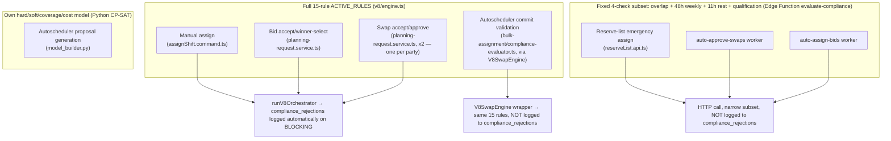

# Chapter 12 — Compliance Engine (Phase 12)

**Confidence:** rule logic and orchestration control flow below is **Verified** — read directly from every rule file, `engine.ts`, the orchestrator, the adapters, and cross-checked against Edge Function source and git history. This chapter corrects two claims from earlier chapters (Ch. 2 §9's structural sketch, and a prior-session memory note about "lexicographic tiering") — see §1.

## 1. Architecture — corrected

Ch. 2 §9 presented the compliance engine as a single funnel: every caller → orchestrator → rules → result. That's directionally right but glosses over three things this deeper pass found:

### 1.1 The rule engine itself has no tiering — a prior claim about "legal_hard » coverage » soft » guardrail » cost" belongs to a different system

`src/modules/compliance/v8/engine.ts` runs all 15 rule functions unconditionally against every context (`ACTIVE_RULES.flatMap(rule => rule(ctx))`) and aggregates afterward: `overall_status = BLOCKING if any hit is blocking, else WARNING if any is a warning, else PASS`. There is no short-circuiting, no priority queue, no early return. The file's own comments group the 15 rules into four informal readability bands (Structural → Staffing → Safety & Breaks → Budget & Patterns) — this is a comment, not an execution mechanism.

**The "legal_hard » coverage » soft » guardrail » cost" lexicographic tiering referenced in earlier project history is real, but it describes the separate Python OR-Tools autoscheduler solver** (`optimizer-service/model_builder.py`), not this TypeScript rule engine — the solver locks each tier at its optimum via CP-SAT lexicographic optimization before considering the next. The one place this terminology appears in the TypeScript layer is a doc comment in `leave-conflict.ts` explaining that `V8_LEAVE_CONFLICT` is BLOCKING "mirroring the solver's legal_hard » coverage tiering" — an analogy, not a shared implementation. Treat these as two independent systems that happen to agree on one design principle (leave/legal constraints always win), not one system.

### 1.2 Six real entry points, three rule sets, inconsistent audit logging

| Path | Rule set | Writes `compliance_rejections`? |
|---|---|---|
| Manual assign | Full 15-rule `ACTIVE_RULES` | Yes, automatic |
| Bid accept / winner-select | Full 15-rule `ACTIVE_RULES` | Yes, automatic |
| Swap accept/approve | Full 15-rule `ACTIVE_RULES` (×2, one per party) | Yes, automatic |
| Autoscheduler — commit-time re-validation | Full 15-rule `ACTIVE_RULES` (via `V8SwapEngine`, not the orchestrator) | **No** |
| Autoscheduler — proposal generation | Separate Python CP-SAT hard/soft/coverage/cost model | No (different system entirely) |
| Reserve-list emergency assign | **Fixed 4-check subset** (overlap, 48h weekly cap, 11h rest, qualification) via Edge Function `evaluate-compliance` | No |
| `auto-approve-swaps` worker (Swap AutoPilot) | Same fixed 4-check subset | No |
| `auto-assign-bids` worker (Bid AutoPilot) | Same fixed 4-check subset | No |

**⚠ Finding (OPEN, documented drift risk, flagged by the code's own authors):** the Edge Function subset covers roughly 4 of the 15 rules — daily-hours cap, 20-in-28, streak limit, spread-of-hours, split-shift, meal-break, min-engagement, multi-hire eligibility, student-visa, and leave-conflict are **not** enforced on the AutoPilot/reserve-list paths. Both AutoPilot workers' own READMEs explicitly call this out as an accepted v1 gap and warn that if a new BLOCKING rule is ever added to `ACTIVE_RULES`, nothing mechanically propagates it to the deployed Edge Function — no test or CI gate keeps them in sync.

**⚠ Finding (OPEN, doc/reality mismatch):** `reserveList.api.ts`'s own header comment asserts it calls "the real, live V8 compliance engine... the same call real shift assignment already makes" — this is **incorrect**. It calls the same narrow `evaluate-compliance` Edge Function as the AutoPilot workers, not `runV8Orchestrator`. Manual assignment (`assignShift.command.ts`) is the one that actually runs the full rule set; Reserve List does not. Worth correcting the comment or the behavior.

**⚠ Finding (OPEN, dormant infrastructure):** `src/modules/compliance/v8/orchestrator/{batch,bidding,swapping,conflict-resolver}/` implement a genuinely sophisticated global-optimization layer — dependency-graph batch execution, greedy fairness-aware bid selection across all shifts simultaneously, structural swap-conflict resolution, and a resource-contention graph solver with GREEDY/SOLVER/HYBRID strategy selection. **None of it has any caller outside its own package** (confirmed by repo-wide grep) and none of it is re-exported from the module's public `index.ts`. The live bid-accept and swap-accept paths bypass this entirely, calling `runV8Orchestrator` per-employee directly instead. This is real, working, seemingly-tested-in-isolation code with zero production callers — worth confirming with the team whether it's future infrastructure being staged or safe to remove.

### 1.3 A global kill switch exists that can silently downgrade every BLOCKING result to WARNING

`runV8Orchestrator` checks a `VITE_COMPLIANCE_BLOCKING_ENABLED` flag *after* logging the true result to `compliance_rejections` but *before* returning to the caller — when disabled, a BLOCKING result is downgraded to WARNING for the caller's purposes (the mutation proceeds), while the underlying BLOCKING event is still faithfully recorded in the audit table. This is a legitimate operational escape hatch (the audit trail stays honest even when enforcement is relaxed), not a bug — but it's a significant lever for a new team to know exists, since its current setting determines whether compliance is actually enforced or merely observed.

### 1.4 Adapters are organized by protocol version, not by caller — corrects a Ch. 1 assumption

`src/modules/compliance/v8/adapters/` contains exactly two files, `v1-to-v8.ts` (legacy flat-shape bridge, used by `bulk-engine.ts`) and `v2-to-v8.ts` (the richer orchestrator-shape bridge, used by the live `runV8Orchestrator` path) — not one adapter per calling module as earlier notes assumed. The actual **per-caller, hypothetical-scenario input builders** live at `src/modules/planning/unified/compliance/input-builder.ts`: `buildAssignInput` (manual assign), `buildBidInput` (pure gain — add the candidate shift), and `buildSwapInputs` (builds **two independent one-sided hypotheticals**, one per party — "if I gave up shift X and got shift Y" — evaluated as two separate engine runs and combined afterward via worst-of-two, not a single joint simulation).

---

## 2. The rule catalog

21 distinct rule IDs across the 15 files in `src/modules/compliance/v8/rules/` (one file, `ordinary-hours-avg.ts`, emits 3; `consecutive-days.ts`, `employment-rules.ts`, and `meal-break.ts` each emit 2). All are **candidate-scoped unless noted** — most skip `is_candidate === false` shifts, meaning committed history is never re-flagged, only the shift(s) actually being added/changed.

| Rule ID | File | Severity | What it checks | Threshold/formula | Award/legal citation | Scope |
|---|---|---|---|---|---|---|
| `V8_LEAVE_CONFLICT` | leave-conflict.ts | **BLOCKING** | Candidate shift falls on an approved-leave date | date-in-set check | Leave system, not an EBA clause | All, candidate-scoped |
| `V8_NO_OVERLAP` | structural-rules.ts | **BLOCKING** | Two same-date shifts overlap in time | `nextStart < currentEnd` | Data-integrity, no clause | All, incl. history |
| `V8_MIN_ENGAGEMENT` | min-engagement.ts | **BLOCKING** | Shift duration below the minimum for its day-type | Training 120min › Sunday/PH 240min › standard 180min (precedence in that order) | ICC EBA (shared source of truth with payroll's billable-time floor) | All, candidate-scoped |
| `V8_QUALIFICATIONS` | employment-rules.ts | **BLOCKING** | Required skill/license/qualification missing entirely | required ⊄ held | — | All |
| `V8_QUALIFICATION_EXPIRED` | employment-rules.ts | **BLOCKING** | Required qualification held but expired by shift date | `expires_at < shiftDate` | — | All (rich-quals data path) |
| `V8_MEAL_BREAK` | meal-break.ts | WARNING | Shift >5h with <30min unpaid break | `duration>300 && break<30` | EBA requirement (clause not numbered in code) | All, candidate-scoped |
| `V8_MEAL_BREAK_CEILING` | meal-break.ts | WARNING | Unpaid break exceeds a sane maximum | `break > 60min` | EBA cl 36 (audit fix L-6) | All, candidate-scoped |
| `V8_REST_PAUSE` | rest-pause.ts | WARNING | Intra-shift paid pause owed but data can't confirm it was taken | 1st pause ≥240min shift; 2nd pause ≥480min | EBA cl 37.1/37.2/37.3 | All, candidate-scoped, advisory by design |
| `V8_MAX_DAILY_HOURS` | daily-limits.ts | **BLOCKING** | Total worked minutes on one calendar date | `>12h` (configurable) | Not clause-cited | All shifts incl. history |
| `V8_SPREAD_OF_HOURS` | spread-of-hours.ts | **BLOCKING** | Earliest start to latest end across all of a day's shifts | `>12h (720min)` | EBA cl 39.2 | All, every shift that day |
| `V8_SPLIT_SHIFT` | split-shift.ts | WARNING | Gap between two same-day engagements | `>180min (3h)` | EBA cl 39.1/39.4/7.14/28.4, Sch 2 | **PART_TIME & FLEXI_PART_TIME only**; excludes MULTI_HIRE pairs |
| `V8_MULTI_HIRE_ELIGIBILITY` | multi-hire-eligibility.ts | WARNING | Same-day MULTI_HIRE pair shares the same role (possible relaxed-terms gaming) | same `role_id` on both sides | EBA cl 13.1(f) | All, pattern-based |
| `V8_MAX_DAILY_ENGAGEMENTS` | max-daily-engagements.ts | **BLOCKING** | More than 2 non-training engagements in one day | `count > 2` | EBA cl 35.4(f) | **CASUAL only** (explicitly excludes STUDENT_VISA too) |
| `V8_MIN_REST_GAP` | rest-requirements.ts | **BLOCKING** | Cross-day rest gap between consecutive shifts | 600min (10h) default; 480min (8h) if mutually agreed or if either shift is MULTI_HIRE | EBA cl 40.1/40.2/40.3 | All, cross-day pairs only (same-day owned by split-shift) |
| `V8_20_IN_28` | consecutive-days.ts | **BLOCKING** | Worked days in any rolling 28-day window | `>20 days` | Not clause-cited (comment: "especially FT") | All |
| `V8_STREAK_LIMIT` | consecutive-days.ts | **BLOCKING** | Consecutive no-gap working-day streak | `>10 days` | EBA cl 35.3(g) | **FLEXI_PART_TIME only** (deliberate — "no EBA basis" for a streak cap on other contract types) |
| `V8_STUDENT_VISA_LIMIT` | student-visa.ts | **BLOCKING** | Rolling 14-day worked hours | `>48h` (configurable) | Australian student-visa condition (statutory, not EBA) | **STUDENT_VISA only** |
| `V8_ORD_HOURS_AVG` | ordinary-hours-avg.ts | **BLOCKING** | Worst rolling-cycle-window ordinary hours vs. hard cap | General: 4wk/152h cap; FT Security: 8wk/336h cap | EBA cl 35; Sch 3 §3 (Security) | Excludes CASUAL; branches by `is_security_role` |
| `V8_ORD_HOURS_PEAK` | ordinary-hours-avg.ts | WARNING | Worst 7/14/21-day window vs. pro-rated weekly limit | `(days/7) × weeklyLimit` (38h general, 42h Security) | EBA cl 35.1(a) | Same scope as above; **suppressed if the hard cap already fired** |
| `V8_ORD_HOURS_CONTRACTED` | ordinary-hours-avg.ts | WARNING | PT/flexi rostered above individually contracted hours | worst 7-day window `> contracted_weekly_hours` | EBA cl 12.3(d) | Only when `contracted_weekly_hours` set and below the general weekly limit |
| `V8_AVAILABILITY_CONFLICT` | availability-rules.ts | WARNING | Candidate shift overlaps another shift/declared unavailability same day | interval overlap | Advisory, no clause | All, incl. history |

**Two disambiguation notes worth keeping visible** (both concepts are easy to conflate by name):
- **`rest-pause` vs. `rest-requirements`**: rest-pause is *intra-shift* (is this one shift long enough to owe a paid break during it — cl 37); rest-requirements is *inter-shift, cross-day* (is there enough downtime between the end of one shift and the start of the next on a different day — cl 40). Same-day pairs are explicitly excluded from rest-requirements and owned by split-shift instead.
- **`split-shift` vs. `spread-of-hours`**: split-shift measures the *gap* between two same-day shifts (≤3h to stay compliant, cl 39.4, PT/flexi only); spread-of-hours measures the *total span* of a whole day regardless of shift count or gaps (≤12h, cl 39.2, everyone). A split shift with a compliant 3h gap can still separately blow the 12h spread cap — they're independent checks, not tiers of the same rule.
- **`structural-rules.ts`** is not a shared-helpers file despite the generic name — it implements exactly one rule, `V8_NO_OVERLAP`.

### Minor code-quality anomalies found while reading the rules (not business-rule bugs, worth a footnote)

- `V8_STREAK_LIMIT`'s violation-message ternary branches on `limit === 10 ? 'Flexi-PT' : 'Standard'`, but the rule only ever runs (and only ever sets the limit to 10) for Flexi-PT — the "Standard" branch is dead code.
- `structural-rules.ts`'s cross-midnight heuristic uses `end_time <= start_time` (treating an exact `start===end` shift as a full 24h shift), while the shared `shiftDurationMinutes`/`normalizedEndMinutes` helpers used by most other rules use strict `<` (treating `start===end` as zero-length) — a real, if narrow, inconsistency in how a degenerate same-value shift is interpreted depending on which rule evaluates it.

---

## 3. Audit trail

`compliance_rejections` (columns: `user_id`, `employee_id`, `operation_type`, `mode`, `stage`, `rule_id`, `rule_status`, `summary`, `details`, `affected_shifts`, `calculation`, `bypassed`) is written **automatically, one row per BLOCKING hit**, only from the `runV8Orchestrator` entry point — see the table in §1.2 for which of the six real entry points that actually covers (three of six). Writes are fire-and-forget (wrapped in try/catch so a persistence failure never blocks the caller) and gated by an opt-out env flag (default on). The manager-facing view is `/compliance/rejections` (`RejectionsPage.tsx`) — recall from Ch. 8 that this route has no client-side `FeatureGate` while its RLS is delta+-only, an inconsistency noted there, not repeated in full here.

---

## 4. Cross-references

Two rules were already touched incidentally in earlier chapters and are cross-referenced rather than re-derived here: `V8_LEAVE_CONFLICT` (Ch. 6 §11, Ch. 7 §4.5 — the leave↔scheduler defense-in-depth story) and `V8_MEAL_BREAK`/`V8_MEAL_BREAK_CEILING` (Ch. 6 §9 — the "Breaks" non-workflow finding). The autoscheduler's own Python-side hard/soft/coverage/cost solver tiers (§1.1) are structurally diagrammed in Ch. 2 §6 but not rule-by-rule documented here — that would be a `optimizer-service/` deep dive outside this chapter's scope (this rulebook covers the TypeScript/DB platform; the Python optimizer service is a separate codebase).
